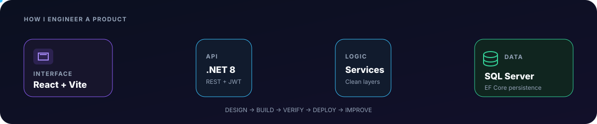
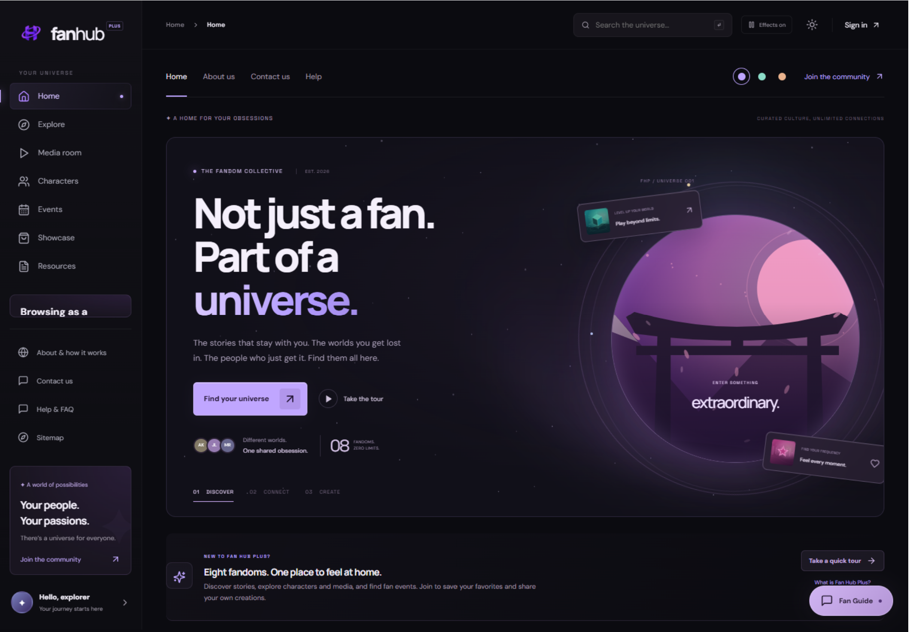

<div align="center">



<br>

<a href="https://fan-hub-plus-two.vercel.app"></a>
<a href="https://github.com/sobhanabdullah30-a11y/Fan-Hub-Plus"></a>
<a href="https://www.linkedin.com/in/sobhan-abdullah-b196953a7"></a>

### `C#` · `.NET 8` · `React 19` · `SQL Server` · `REST APIs` · `CI/CD`

</div>

---

## 👨‍💻 The Engineer Behind the Code

I'm **Subhan Abdullah**, a Full-Stack Developer and Robotics & Intelligent Systems student at Bahria University. I turn real requirements into software with a clear path from **data model → API contract → interface → deployment**.

My work sits at the intersection of dependable backend engineering and polished frontend experiences. I care about code that is **secure, maintainable, accessible and understandable** long after the first release.

| What I build | How I build it |
| --- | --- |
| **Production-ready web applications** | Layered architecture and explicit contracts |
| **Secure APIs and account systems** | JWT sessions, authorization and validation |
| **Responsive product interfaces** | React, accessible UI and purposeful motion |
| **Reliable data-driven features** | EF Core, SQL Server and relational modeling |
| **Repeatable delivery workflows** | Git, GitHub Actions, testing and deployment |

<br>



---

## 🚀 Featured Build — Fan Hub Plus

<div align="center">

### **Not just a fan. Part of a universe.**

An immersive, full-stack platform for discovering stories, characters, media, releases and events across eight fandom universes.

<a href="https://fan-hub-plus-two.vercel.app">
  
</a>

<br><br>

[](https://fan-hub-plus-two.vercel.app)
[](https://github.com/sobhanabdullah30-a11y/Fan-Hub-Plus)
[](https://github.com/sobhanabdullah30-a11y/Fan-Hub-Plus/actions/workflows/ci.yml)

</div>

### Engineering highlights

<table>
<tr>
<td width="50%" valign="top">

#### 🎨 Product Experience

- Eight rich fandom universes
- Search, filters and editorial discovery
- Responsive themes and accent controls
- Reduced-motion and accessibility support
- Content, media, events and release tracking

</td>
<td width="50%" valign="top">

#### 🔐 Identity & Community

- Verified member accounts
- JWT-based secure sessions
- Bookmarks, private notes and ratings
- Feedback and moderated submissions
- Role-based member and admin experiences

</td>
</tr>
<tr>
<td width="50%" valign="top">

#### ⚙️ Backend Engineering

- Layered **ASP.NET Core 8** architecture
- RESTful controllers and OpenAPI docs
- Repository and service contracts
- EF Core persistence with SQL Server
- Validation, rate limiting and secure secrets

</td>
<td width="50%" valign="top">

#### 🚢 Quality & Delivery

- Frontend and backend verification suites
- ESLint and Prettier quality gates
- GitHub Actions continuous integration
- Vercel production frontend
- Hosted API with same-origin proxy routing

</td>
</tr>
</table>

### System stack

| Layer | Implementation |
| --- | --- |
| **Interface** | React 19, Vite 6, JavaScript, responsive CSS, Lucide React |
| **API** | C#, ASP.NET Core 8, REST, Swagger/OpenAPI |
| **Application** | DTOs, validation, AutoMapper, repository and service contracts |
| **Security** | JWT, role-based authorization, password hashing, session revocation |
| **Persistence** | Entity Framework Core 8 and Microsoft SQL Server |
| **Delivery** | GitHub Actions, Vercel and hosted ASP.NET Core infrastructure |

---

## 🧰 Engineering Toolkit

<div align="center">

### Languages & Frameworks


### Workflow & Platforms


</div>

```text
Backend       C# · ASP.NET Core · REST APIs · EF Core · OpenAPI
Frontend      React · Vite · JavaScript · TypeScript · Responsive UI
Data          SQL Server · Relational modeling · Migrations · Query design
Security      JWT · Authentication · Authorization · Validation · Secrets
Delivery      Git · GitHub Actions · Vercel · CI/CD · Production config
```

---

## 🧠 Engineering Principles

> **Strong software is more than working code—it is a clear set of decisions that another engineer can understand, verify and improve.**

- **Start with the problem** — understand the user and the system boundary before choosing technology.
- **Design contracts deliberately** — keep data models, APIs and UI states explicit.
- **Secure the defaults** — validate input, protect secrets and authorize every sensitive action.
- **Verify critical behavior** — test ownership, permissions, failure states and integration boundaries.
- **Ship in observable steps** — use source control, CI and deployment checks to reduce uncertainty.
- **Keep improving** — treat feedback and production learning as part of engineering.

---

## 🎯 Current Direction

<table>
<tr>
<td width="50%" valign="top">

### Building deeper expertise

- Advanced ASP.NET Core patterns
- Entity Framework Core performance
- React application architecture
- API security and automated testing

</td>
<td width="50%" valign="top">

### Growing toward

- Scalable system design
- Cloud-ready delivery workflows
- Reusable product design systems
- High-quality engineering collaboration

</td>
</tr>
</table>

---


---

## 🎓 Education & Professional Learning

**Bahria University** — Robotics & Intelligent Systems<br>
Building foundations across software development, intelligent systems, computer systems and engineering problem-solving.

**Certificate of Proficiency in Information Systems Management (CPISM)**<br>
**Diploma in Information Systems Management (DISM)**

---

## 🤝 Let's Build Something Valuable

I'm open to **full-stack development roles, software projects and thoughtful technical collaborations**.

<div align="center">

<a href="mailto:sobhanabdullah30@gmail.com"></a>
<a href="https://www.linkedin.com/in/sobhan-abdullah-b196953a7"></a>
<a href="https://x.com/juniorsobhan"></a>

### **Design with intent · Build with discipline · Ship with confidence**

</div>
